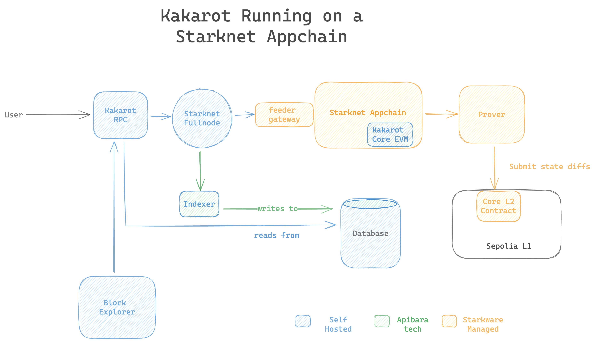

# Running Kakarot RPC on a Starknet Appchain

Running Kakarot zkEVM on a Starknet appchain relies on the following architecture.



## Running the stack in a docker compose

To run this system, one needs to:
- run a Starknet node and point it to the feeder gateway of the corresponding Starknet appchain.
- deploy _once_ Kakarot Core EVM written in Cairo (using the kkrt-labs/kakarot/scripts/deploy_kakarot.py script)
- run this [docker compose file](./docker-compose.yaml)

The docker compose file in this folder runs the RPC layer altogether, granted there is a Starknet node running already and a Kakarot instance deployed on the Starknet appchain.

## How to run the RPC layer and deploy Kakarot Core EVM.

 Run Juno:
 ```
 docker run -d \
 --http
 --http-port=5050
 --http-host=0.0.0.0
 --db-path=/var/lib/juno
 --cn-name=KakarotSepolia
 --cn-feeder-url=https://feeder.juno.giansalex.dev
 --cn-gateway-url=https://gateway.juno.giansalex.dev
 --cn-l1-chain-id=sepolia
 --cn-l2-chain-id=kkrt
 --cn-core-contract-address=0xabde1
 "--eth-node=<YOUR-ETH-NODE>"  Replace <YOUR-ETH-NODE> with your actual ETH node address
 ```

 Run Kakarot deploy script once locally, then write down the:
 ```
 - KAKAROT_ADDRESS=
 - DEPLOYER_ACCOUNT_ADDRESS=
 - PROXY_ACCOUNT_CLASS_HASH=
 - EXTERNALLY_OWNED_ACCOUNT_CLASS_HASH=
 - CONTRACT_ACCOUNT_CLASS_HASH=
```

Run the docker compose and be sure to add the above variables in the environment.
