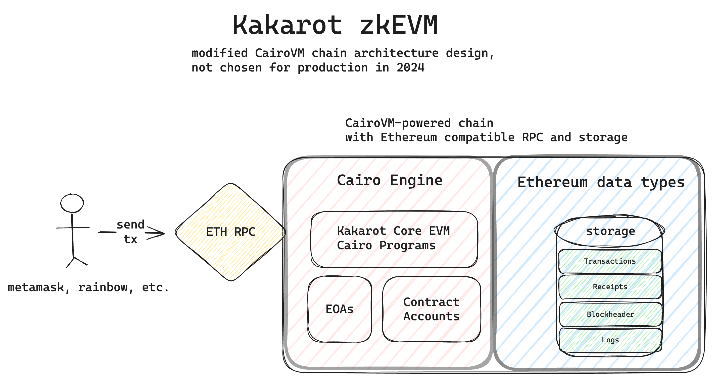

# Kakarot Indexer

Kakarot Indexer fits in the three-part architecture of the Kakarot zkEVM rollup
(Kakarot EVM Cairo Programs, Kakarot RPC, Kakarot Indexer). It indexes the
underlying CairoVM network on which Kakarot core is deployed in an Ethereum
compatible format.

    

## Table of Contents

- [Motivation and FAQ](#motivation-and-faq)
- [Installation](#installation)
- [Usage](#usage)
- [License](#license)

## Motivation and FAQ

_Why is an indexer needed?_

- Because CairoVM chains (also called StarknetOS chains) have different data
  types, it is necessary to reformat the data in an Ethereum compatible way. We
  decided to perform this reformatting outside of the CairoVM chain, resulting
  in duplication of data, but more modularity. Note that this reformatting
  could've been done at runtime, at a high computational cost. Lastly, a third
  option would consist in forking a CairoVM client (e.g. Starknet) and change
  the data types directly within the storage of the full node.

_Why not directly modify a CairoVM client?_

- CairoVM chains are very novel and evolve quite fast. We are thus waiting for
  more stability to directly fork/modify a client. New engines, storage
  technologies and other innovations are being developed by talented teams (e.g.
  [Starknet](https://starkware.co/starknet/),
  [Katana](https://book.dojoengine.org/toolchain/katana/overview.html),
  [Madara](https://madara-docs.vercel.app/)).

For reference, click to see how the above-mentioned monolithic architecture
would look like (note that it is not the current architecture of Kakarot zkEVM):

## Installation

The Kakarot Indexer is based on the [Apibara](https://www.apibara.com/docs)
third-party service, an indexing product for StarknetOS chains. Apibara relies
on [Deno](https://deno.com/), a specific Javascript runtime. Follow the Deno
installation requirements to be able to interact with the codebase.

## Usage

Although this codebase is open-source, it relies on third-party software, the
[DNA protocol](https://www.apibara.com/docs/advanced/streaming-protocol). One
may read the code, run it locally, or self-host the indexer using Apibara's
documentation and API keys.

## License

[MIT License](./docs/LICENSE)
